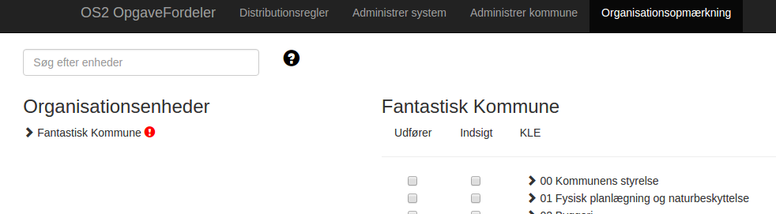
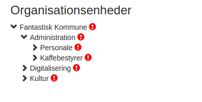
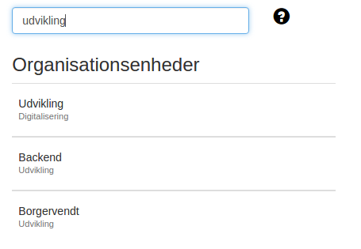
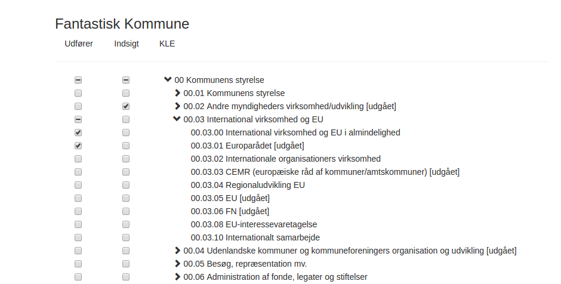

# OS2Opgavefordeler

Opmærkning af enheder med KLE

**Version** :        1.0.0

**Date** :        20.03.2017

**Author** :        BSG

# 1. Indledning

OS2Opgavefordeler har i seneste udgave fået tilføjet funktionalitet der muliggør opmærkningen af ens organisation med KLE.

Funktionaliteten understøtter at man kan KLE opmærke sin organisatoriske enheder med forskellige opmærknings-relationer, dvs at man for en given enhed kan angive hvilke KLE som enheden er &#39;udførende&#39; på, og hvilke enhedens medarbejdere har behov for &#39;indsigt&#39; i, for at kunne udføre deres arbejde.

# 2. Adgang til KLE opmærkning

For at en bruger kan tilgå den nye funktionalitet skal de have tildelt rettigheden &#39;KLE Opmærker&#39;. Denne rettighed kan opsættes af driftsoperatøren Miracle for den enkelte kommune.

# 3. Anvendelse af KLE opmærkning

Dette afsnit beskriver hvordan man anvender OS2Opgavefordelers brugergrænseflade.

## 3.1 Tilgå brugergrænsefladen

Navigation til KLE opmærkning sker ved at anvende navigationsbaren i toppen af OS2Opgavefordeler. Her skal man vælge menupunktet &#39;Organisationsopmærkning&#39;.

## 3.2 Fremsøge enhed

Når man har tilgået siden &#39;Organisationsopmærkning&#39;, kan man anvende venstre side til at fremsøge den eller de organisationsenheder som man ønsker opmærket. Bemærk at der er 2 måder at fremsøge en enhed på

1. Man kan anvende træstrukturen, og klikke på pilene til venstre for de enkelte enheder for at navigere igennem organisations hierarkiet

2. Man kan anvende søge-feltet, og angive navnet på den enhed man ønsker at opmærke som søgeord.

### 3.2.1 Finde enheder der ikke er opmærket endnu

Som en specialfunktion af det at fremsøge en enhed, er det muligt at fremfinde de enheder der endnu ikke er opmærket. En enhed uden opmærkning vil fremstå med et rødt udråbstegn i træstrukturen, og man kan anvende søgefeltet til at liste alle enheder der ikke er opmærket endnu (ved at skrive \*tom\* i søgefeltet).

## 3.3 Opmærke enhed

Når man har valgt en enhed, kan man begynde at opmærke den i højre side af skærmbilledet.

Højre side af skærmbilledet viser de KLE hovedgrupper, grupper og emner som er indlæst i OS2Opgavefordeler, og det er muligt ved at anvende checkboxene, at angive hvilke KLE som enheden hhv er udførende på, og hvilke der er indsigtsbehov på.

Bemærk at man på Internet Explorer 11, Edge, Chrome, Firefox og andre nyere browsere, får vist et halvt-check i en checkbox hvis en af de underlæggende grupper eller emner er checket. Dette understøtter at det er nemt at se hvor der er KLE opmærket, selvom KLE træet er foldet sammen.

# 4. Anvendelse af API&#39;et til udtræk af KLE opmærkning

Dette afsnit beskriver de nye API operationer, der kan anvendes til at trække oplysninger om KLE opmærkning ud af OS2Opgavefordeler.

Der er ét enkelt API håndtag, som anvendes ved at lave en HTTP GET mod endpointet

	/api/ou/{businessKey}

Her skal businessKey udfyldes med den nøgle som man har angivet på enheden da den blev læst ind i OS2Opgavefordeler. Eksempelvis

	/api/ou/bc5fed00-1bdd-4daf-9e6b-d9c80ed6db0e

Hvis man kalder uden yderligere argumenter, får man returneret en JSON struktur der angiver hvilke KLE som den pågældende enhed er opmærket med. Et eksempel på output vil være følgende

	{
		"INTEREST": [
			"00",
			"01.00",
			"01.05.00"
		],
		"PERFORMING": [
			"01.02"
		]
	}

Man kan vælge at filtrere output, så man kun modtager én af de to opmærkningstyper, fx PERFORMING, så laver man følgende kald

	/api/ou/bc5fed00-1bdd-4daf-9e6b-d9c80ed6db0e?assignmentType=PERFORMING

Og så modtager man følgende svar

	{
		"PERFORMING": [
			"01.02"
		]
	}

Og man kan bede om at få foldet KLE tildelinger ud på emne-niveau, ved at lave følgende kald

	/api/ou/bc5fed00-1bdd-4daf-9e6b-d9c80ed6db0e?assignmentType=PERFORMING&showExpanded=true

Hvilket vil give følgende resultat

	{
		"PERFORMING": [
			"01.02",
			"01.02.00",
			"01.02.01",
			"01.02.02",
			"01.02.03",
			"01.02.04",
			"01.02.05",
			"01.02.07",
			"01.02.08",
			"01.02.09",
			"01.02.10",
			"01.02.12",
			"01.02.15",
			"01.02.16",
			"01.02.17",
			"01.02.20",
			"01.02.25",
			"01.02.27",
			"01.02.32",
			"01.02.36",
			"01.02.40"
		]
	}

