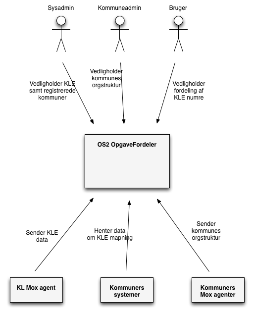
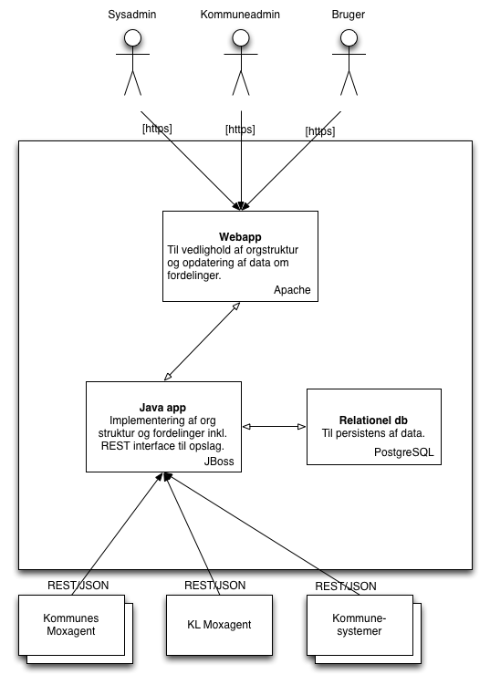
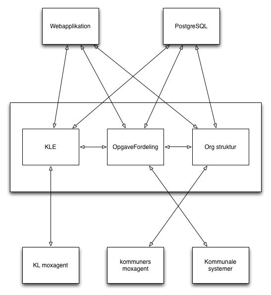

Software Guidebook for OS2 OpgaveFordeler
=========================================

# 1. Introduktion
Dette skriv giver et overblik for hvordan det er tænkt at lave OS2 OpgaveFordeler. Det inkluderer følgende:

1. Krav, constraints og principper.
2. Software arkitekturen.

# 2. Kontekst
OS2 OpgaveFordeler laves som java applikation med REST interface samt tilhørende webapplikation. 
REST interface giver mulighed for opslag for mapningen mellem KLE-numre og ansvarlig entitet for håndtering af denne.
Webapplikationen giver mulighed for at vedligholde de tilgængelige data/relationer.
Følgende konteksdiagram viser applikation og aktører:

Formålet med applikationen er at udstille og vedligholde data for mapning mellem en kommunes opgaver og dem der er ansvarlige for at udføre dem.

Brugere
---
Der er tre slags brugere af applikationen

**1. Sysadmin**
Denne bruger kan administrere de forskellige kommuners opsætning.

**2. Kommuneadmin**
Denne administrator kan vedligholde en kommunes organisationsstruktur.

**3. Bruger**
Denne bruger kan lave fordelinger af samt flytte ansvar for opgaver. Dette er det typiske scenarie.

Eksterne systemer
---
Der er flere eksterne systemer som interagerer med OS2 OpgaveFordeler.

**1. KL Mox agent** Dette system leverer KLE strukturen som repræsenterer en kommunernes opgaver.

**2. Kommuners Mox agent** Disse systemer leverer information om kommuners organisationsstruktur.

**3. Kommunale systemer** Disse systemer trækker oplysninger om en kommunes delegering af et KLE-nummer.

# 3. Funktionelt Overblik
OS2 OpgaveFordeler handler om en kommunes forbindelse mellem KLE-numre og den entitet der håndterer det pågældende emne hvad enten det er en afdeling eller en medarbejder.

KLE-numre
---
KLE-numre kommer fra KL og indlæses via mox agent eller en sysadmin. KLE-strukturen er fælles for alle kommuner.

Kommuner og Organisationsstruktur
---
Hver kommune kan oprettes som selvstændig enhed i applikationen. De har administratorer som vedligholder kommunens organisationsstruktur og har derudover brugere der vedligholder mapning mellem KLE-numre og afdelinger eller medarbejdere.

Kommuner oprettes og vedligholdes overordnet set af sysadmin.

REST interface
---
Oplysninger om hvem der håndterer KLE-numre for en kommune, kan trækkes via REST/JSON til brug ved integration.

# 4. Quality Attributes/Nonfunktionelle krav
Performance
---
Alle funktioner i OS2 OpgaveFordeler skal svare på under n sekunder for n samtidige brugere.
REST interface skal kunne håndtere nn/s.

Scalability
---
OS2 OpgaveFordeler skal kunne skalere til n gange forventet anvendelse.

- 10 gange eksisterende KLE-numre (nn).
- nn kommuner med:
  - nnn afdelinger.
  - nnn brugere.
  - nnn fordelinger.

Availability
---
Applikationen skal være tilgængelig ...

Internationalisation
---
Webapplikationen leveres på dansk. I REST interface vil der benyttes engelsk terminologi.

Localisation
---
Webapplikation kører dansk. REST interface engelsk.

Browser kompatabilitet
---
Webapplikationen skal virke på nyeste versioner af følgende browsere med javascript aktiveret:

- Google Chrome
- Internet Explorer
- Firefox
- Safari

# 5. Constraints
OS2 OpgaveFordeler skal udvikles med open source teknologi. Der er valgt Java og js.

Deployment på Apache webserver og JBoss Wildfly/EAP6. 

Der skal benyttes SAML til authentication.

# 6. Principper
Id'er defineres med long.

tabs til indentation.

Anvendte Exceptions:
- AuthorizationException
- AuthenticationException
- BadServiceArgumentException

Der anvendes PresentationObjects (PO) til kommunikation. 

Continuos integration
---
Der etableres continuos integration til web interface og java applikation.

Automated testing
---
Der etableres automatisk afvikling af unit tests.

Configuration
---
Al konfiguration vil foregå i .properties filer for at holde det ude af applikatonen og styre deployment på tværs af miljøer.

# 7. Software Arkitektur
Her følger et overblik over arkitekturen.

Containers
---
Dette diagram viser de forskellige dele af applikationen fordelt på containere. Opdeling er kun på typer af container og repræsenterer ikke antal.

**Webapplikationen** hostet på Apache giver mulighed for at vedligholde fordelinger, organisationsstrukturer samt KLE. Det er en applikation lavet i Angular/HTML5 som benytter REST interfacet i java applikationen.

**Java applikationen** hostes på JBoss og sørger for alt omkring authentication, authorization og udstiller via REST, interface til opslag og vedlighold på KLE, orgstrukturer samt regler for fordeling.

**Relationel db** i form af PostgreSQL benyttes til persistens fra Java applikationen.

Komponenter i Java applikation
---
De tre primære komponenter i Java applikationen omhandler KLE, Kommuners organisationsstruktur samt selve fordelingerne.

# 8 Infrastructure Architecture
Testsystem er på os2opgavefordeler-test.miracle.dk (10.7.4.92)
Prod er på os2opgavefordeler.dk (10.7.4.78)
begge servere kan tilgås via ssh, når public key er installeret.
Alle elementer i applikationen er installeret på hver server.

**Backup og restore**

Systemet indeholder mulighed for at restore data for en given kommune i tilfælde af, at data (fordelingsregler, ansvar osv.) skulle gå tabt.

Backup af de enkelte kommuners data i systemet foregår vha. et script, som kører hver nat kl 02.

Dette er konfigureret i postgres-brugerens crontab (som kan ses ved at køre kommandoen "crontab -e", mens du er logget ind som postgres).

Crontab'en kalder følgende script:

`0 2 * * * /etc/topicrouter-backup >/dev/null 2>&1`

som så igen kalder psql med indholdet af topicrouter.crontab.sql-filen. Det er denne, der indeholder selve restore-/backup-funktionaliteten.

Det kaldende script er som følger:

~~~~
#!/bin/sh
cat /etc/topicrouter.crontab.sql | psql --no-align --tuples-only --dbname=topicrouter --set=MuId=20001 > /opt/miracle/backups/topicrouter.20001.$(date +%F).sql;
exit 0
~~~~

Det er også her der defineres hvilket kommune-id, der skal foretages backup for, så nye kommuner skal tilføjes til denne fil.

I ovenstående foretages indtil videre kun backup for Syddjurs, der har kommune-id 20001.

Selve SQL backup-/restore-scriptet kan findes her:

`/TopicRouter/src/main/resources/scripts/topicrouter.crontab.sql`

Scriptet er skrevet i PostgreSQL og fungerer ved at danne en serie SQL-udtryk, som kan benyttes til at restore data for én kommune til tilstanden for en given dato.

Udtrykkene sletter først eksisterende data i topicrouter-databasen for en given
kommune og importerer derefter data for den givne dato.

Disse data er indeholdt i selve scriptet i det format som pg_dump anvender.

Mere lavpraktisk, så foregår det som følger:

1) Alle tabeller låses
2) Eksisterende data for det givne kommune-id slettes
3) CONSTRAINTS fjernes, så der kan bruges COPY...FROM
4) Data for det givne kommune-id indlæses med COPY...FROM
5) CONSTRAINTS genetableres

Med udgangspunkt i at ligne pg_dump mest muligt, anvendes “COPY FROM” og ikke den langsommere “INSERT INTO”.

Eksempel på indlæsning af data til en tabel fra et genereret script, fx "topicrouter.20001.2016-11-02.sql":

~~~~
  COPY table_1 (id, value) FROM stdin;
  7    9
  7    13
  \.
~~~~

For at crontab-scriptet kan generere ovenstående output udføres:

~~~~
  \echo COPY table_1 (id, value) FROM stdin;
  COPY (SELECT id, value FROM table_1 WHERE id=7) TO stdout;
  \echo '\\.'
~~~~

Se ovennævnte SQL-script for flere informationer.

# 9 Deployment
Deploymentprocedure er som følger:

- Byg release med mvn i parent dir og -P 'target-test' eller 'target-prod' alt efter hvor du skal deploye - så sørger maven for de korrekte properties.
- Kopier fra /sources/frontend/target/frontend-version.jar og /sources/TopicRouter/target/TopicRouter.war til rette server og placer dem i ~/deploy/ med version for historik. E.g. med scp: scp /sti/til/war ssh-config-profil:~/ 
- Der ligger deploy script til frontend. Pak jar filen ud i /home/miracle/deploy/web/ og kør scriptet.
- Kopier backend war fil til /tmp/ eller andet og lav undeploy/deploy via ~/jboss-cli.sh
 
Der bruges semantic versioning med mm.ss.pp hvor mm er hovedreleases, ss er mindre og pp er patches.

# 10 Operations and support 
From a security perspective, details about infrastructure are listed in a protected wiki.